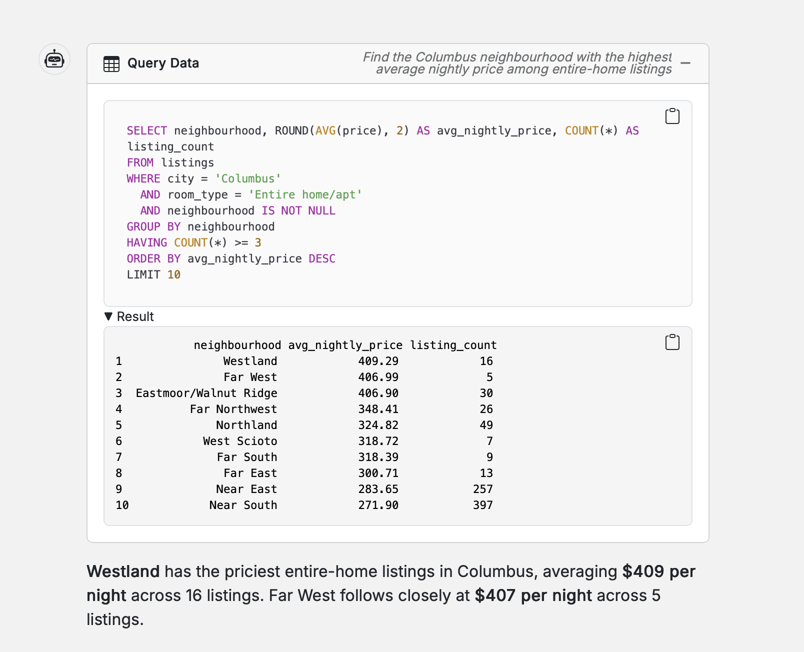
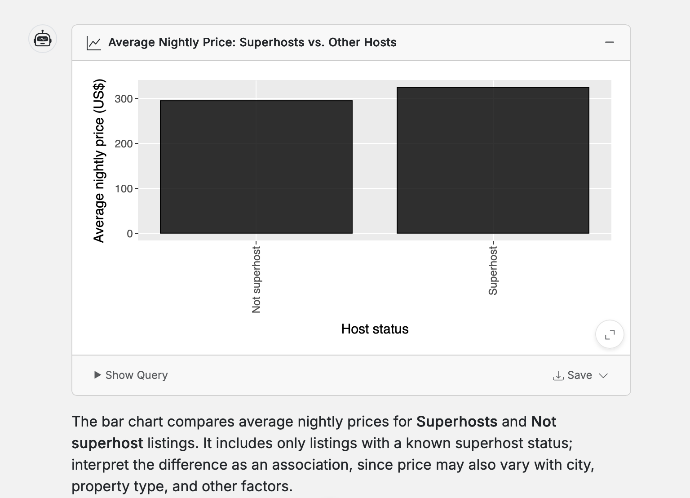
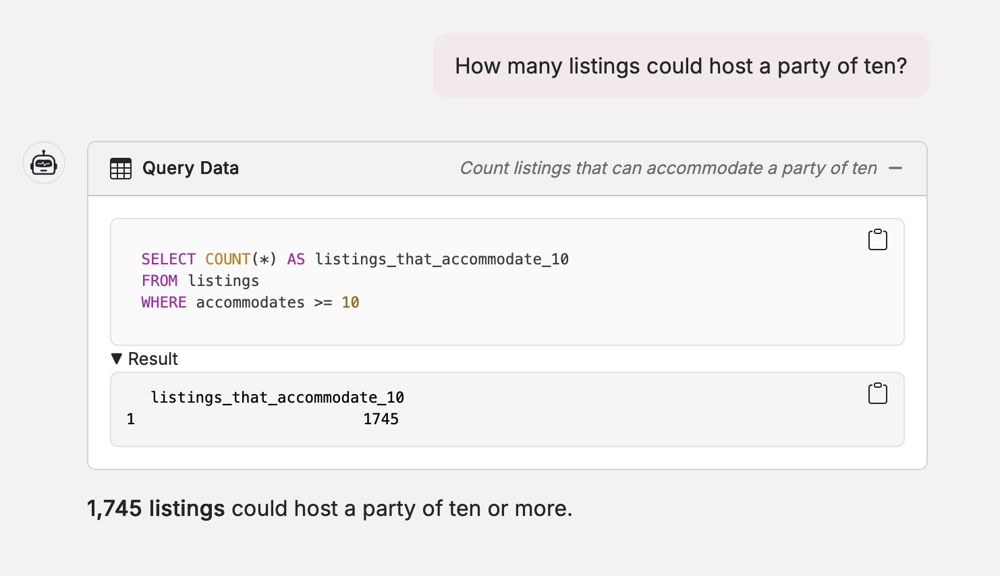

# ISA 401 Job Scout Chat

**Ask a question in plain English, get the SQL and a table back**

A twelve-line [querychat](https://github.com/posit-dev/querychat) app built in ISA 401 (Miami University) on the job postings that [ChatISA](https://chatisa.fsb.miamioh.edu) Job Scout collected. It is the starting point for Assignment 05, where you rebuild it on the Airbnb data, deploy it to [Render](https://render.com) from your GitHub repository, and then improve it.

**Live app:** https://midwest-airbnb-chat-e02j.onrender.com

## Technology Stack

- **[Shiny](https://shiny.posit.co/)** - Web application framework for R
- **[querychat](https://github.com/posit-dev/querychat)** - Natural language data querying
- **[ellmer](https://ellmer.tidyverse.org/)** - LLM client for R
- **[RSQLite](https://rsqlite.r-dbi.org/)** - SQLite driver for R

---

## Course Information

This application was developed for **ISA 401** at **Miami University**. The polished version of the same idea, built on BLS wage data, is the [OEWS Jobs Explorer](https://huggingface.co/spaces/fmegahed/querychat_demo).

## Questions I asked the application

## Example questions

Which Columbus neighbourhood has the priciest entire homes? Westland

Do superhosts charge more per night than other hosts? Show it as a bar chart.

How many listings could host a party of ten? 1,745

